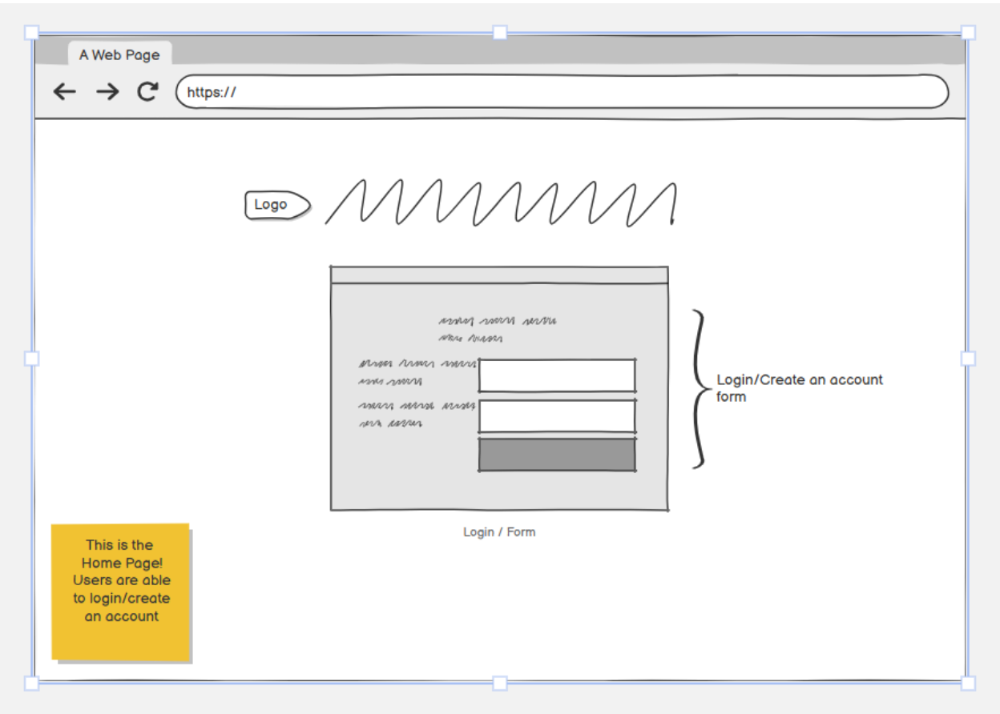
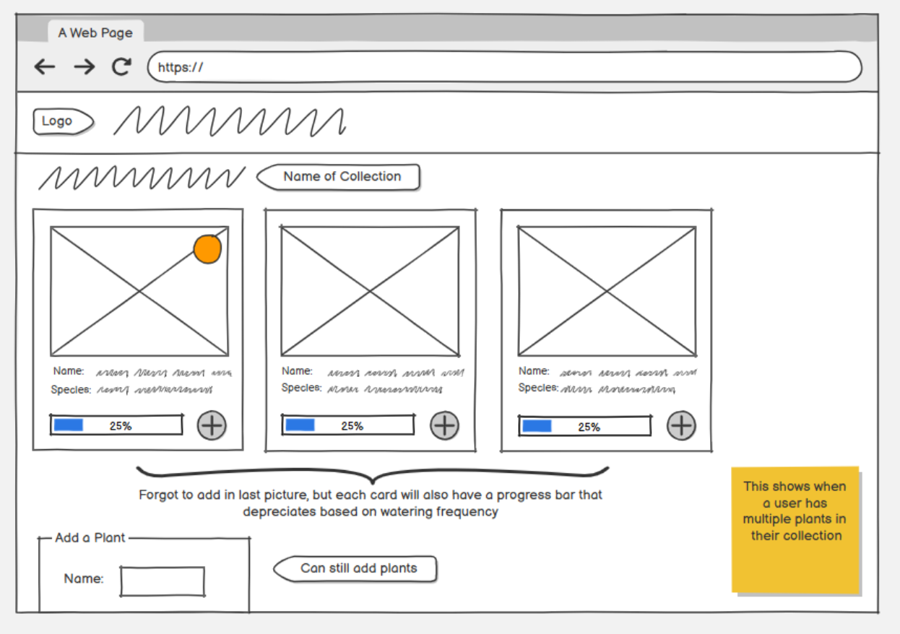
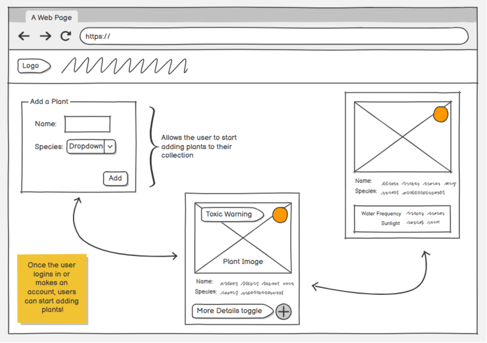
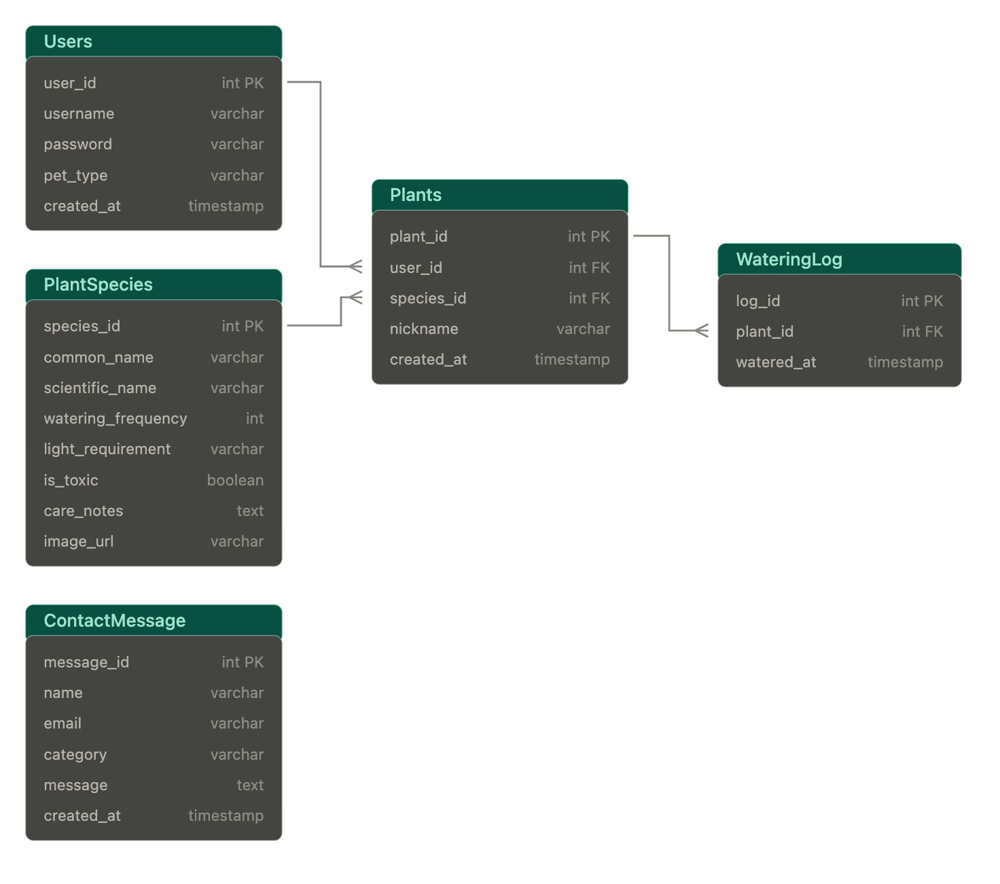

# 🌿 Flourish

Flourish is a full stack plant care companion app designed for plant lovers of all experience levels — from the beginner who just bought their first pothos to the seasoned botanist with a collection of over thirty species. Built with React on the frontend and Java Spring Boot on the backend, Flourish allows users to build and manage their personal plant collection, view detailed care information like watering frequency and light requirements, and instantly identify which plants may be harmful to their pets. Whether you're caring for a rare fiddle leaf fig or a forgiving spider plant, Flourish makes plant care feel less like a chore and more like tending to a living, breathing companion — turning everyday routines into small, rewarding moments of nurture.

---

## 🛠️ Technologies Used

### Backend
- Java 21
- Spring Boot 4.1.1
- Spring Data JPA / Hibernate ORM
- Maven
- MySQL

### Frontend
- React (Vite)
- React Router
- JavaScript
- CSS3 with custom properties
- Google Fonts (Mansalva, Gelasio)
- Fetch API

### Tools
- IntelliJ IDEA (backend)
- VS Code (frontend)
- Git / GitHub
- Postman (API testing)
- MySQL Workbench

---

## ⭐ MVP Features

### Plant Collection Management
- Users can add plants to their personal collection by providing a nickname and species name
- Each plant card displays the plant's image, nickname, species name, and a toxicity badge indicating whether it is safe or harmful to pets
- Users can remove plants from their collection with a confirmation modal to prevent accidental deletions

### Plant Care Information
- Clicking the toggle button on any plant card reveals detailed care information fetched live from the backend
- Care details include watering frequency, light requirements, and general care notes specific to that species

### Pet Safety Warnings
- Every plant card displays a clear toxicity badge — Toxic to Pets or Safe for Pets — so users like Mara can make informed decisions about which plants to bring home with Mickey around

### Contact Form
- Users and visitors can submit questions, bug reports, or feature requests through the contact form
- Messages are saved directly to the database and persist between sessions

---

## 📱 Responsive Design
Flourish was built with dedicated breakpoints for multiple screen sizes:
- **Desktop:** Full multi-column card grid layout across the collection page
- **Tablet:** Plant cards stack into fewer columns with adjusted spacing
- **Mobile:** Cards go full width and the header stacks vertically for easy navigation

---

## 🚀 Installation Instructions

### Prerequisites
- Java 21
- Node.js and npm
- MySQL
- Maven
- Git

### 1. Clone the repository
```bash
git clone https://github.com/fedallxn/Unit2-Flourish-final.git
```

### 2. Database Setup
Create a local MySQL database:
```sql
CREATE DATABASE Flourish;
```

### 3. Backend Setup
Navigate to the backend folder:
```bash
cd BACKEND
```

Configure your local database connection in `src/main/resources/application.properties`:

spring.datasource.url=jdbc:mysql://localhost:3306/Flourish
spring.datasource.username=your_username
spring.datasource.password=your_password
spring.jpa.hibernate.ddl-auto=update
spring.sql.init.mode=always

Run the Spring Boot application in IntelliJ IDEA — the database will be seeded automatically on first launch!

### 4. Frontend Setup
In a separate terminal, navigate to the frontend folder:
```bash
cd FRONTEND
npm install
npm run dev
```

Open your browser and navigate to `http://localhost:5173`

> ⚠️ Make sure your Spring Boot backend is running on port 8080 before launching the frontend!

---

## 🖼️ Wireframes

Initial wireframes used to plan the layout and flow of Flourish — from the welcoming homepage to the plant collection and beyond!

> 💡 *"Subject to change — but you already knew that!"* 🌱

### 🏠 Homepage


### 🌿 Plant Collection


### 🌱 Add Plant Form/Toggle Info


---

## 🗄️ ER Diagram
The relational data model showing Users, Plants, Species, WateringLog, and ContactMessage:



---

## 🔮 Unsolved Problems & Future Features

### Health Bar & Gamification
- Each plant will have a visual health bar that depletes over time based on its watering frequency and replenishes when the user logs a watering — almost like a Tamagotchi for your plants
- Health bar color will change from green to yellow to red as the plant becomes more overdue for watering
- A watering history log will track every time a plant was watered with timestamps

### User Authentication
- Users will be able to register and log in so each person has their own private plant collection
- Currently userId is hardcoded to user 1 — authentication will replace this with a real session
- Passwords will be hashed using BCrypt before being stored in the database

### External API Integration
- Connect to the Perenual API so that care information is automatically populated when a user adds a plant by name
- Currently users must type the exact species name to match the database

### Known Issues
- **UserId is hardcoded** — Without authentication the app defaults to userId 1. Full user switching will be implemented with auth in a future update
- **New plants show species image** — Plants added through the form receive the default species image. Custom plant photos are not yet supported
- **No input validation feedback** — If a user types an invalid species name the form closes without adding a plant. A user-facing error message will be added in a future update

---

## 📚 What I Learned

Building Flourish provided hands-on experience with:
- Designing and implementing a full stack application connecting React to Spring Boot
- Debugging Hibernate and JPA issues including lazy loading, circular references, and column naming mismatches
- Using @JsonIgnore and @JsonIgnoreProperties to control API response serialization
- Designing relational data models with MySQL and JPA ORM annotations
- Implementing CORS configuration to allow cross-origin requests between frontend and backend
- Connecting React state management to real backend data using async fetch and useEffect
- Debugging end-to-end issues across frontend, backend, and database layers
- Pre-seeding a database with SQL scripts for demo-ready data on first launch

---

## 👤 Author

Built by **Faith Dall**, as part of the LaunchCode Women+ Software Development Course, Unit 2 Final Project.

- GitHub: [@fedallxn](https://github.com/fedallxn)
- LinkedIn: [Faith Dall](https://linkedin.com/in/your-linkedin)

---

## 📝 License

Flourish was created for educational and portfolio purposes.
